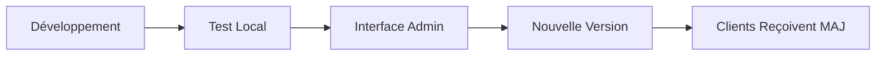

# 🖥️ Interface d'Administration des Mises à Jour

## Vue d'ensemble

L'interface d'administration vous permet de gérer facilement les versions de votre application MATELAS_FINAL via une interface web moderne et intuitive.

## 🚀 Démarrage

### Option 1 : Interface seule
```bash
python3 start_admin_interface.py
```
- **Interface Admin** : http://localhost:8081
- Idéal pour développement et tests

### Option 2 : Système complet
```bash
python3 start_complete_update_system.py
```
- **API Server** : http://localhost:8080 (pour les clients)
- **Interface Admin** : http://localhost:8081 (pour l'administration)
- Recommandé pour la production

## 📊 Dashboard Principal

### Statistiques en temps réel
- **📦 Versions** : Nombre total de versions disponibles
- **📥 Téléchargements** : Compteur total des téléchargements
- **💾 Stockage** : Espace disque utilisé par les packages
- **🕒 Dernière MAJ** : Date de la dernière mise à jour

### Actions rapides disponibles

#### 1. 🆕 Création Automatique de Version

**Avantages :**
- ✅ Incrémentation automatique de la version
- ✅ Création du package ZIP automatique  
- ✅ Publication immédiate pour les clients
- ✅ Mise à jour du changelog

**Utilisation :**
1. Sélectionnez le type de version :
   - **Patch** (3.9.0 → 3.9.1) : Corrections de bugs
   - **Minor** (3.9.0 → 3.10.0) : Nouvelles fonctionnalités
   - **Major** (3.9.0 → 4.0.0) : Changements majeurs

2. Saisissez une description
3. Cliquez "Créer et Publier"

#### 2. 📤 Upload Manuel

**Utilisation :**
- Glissez-déposez un fichier ZIP
- Saisissez la version (ex: 3.11.0)
- Ajoutez une description
- Optionnel : Changelog détaillé

## 🎛️ Gestion des Versions

### Liste des versions
Chaque version affiche :
- **🏷️ Numéro de version** avec badge "Latest" pour la plus récente
- **📅 Date de création**
- **📝 Description**
- **📊 Statistiques** : téléchargements et taille
- **🔗 Actions** : télécharger ou supprimer

### Actions sur les versions

#### Télécharger
- Cliquez sur le bouton 📥
- Le package ZIP sera téléchargé
- Utile pour backup ou redistribution manuelle

#### Supprimer
- Cliquez sur le bouton 🗑️
- Confirmation requise
- Suppression définitive du serveur

## 🔄 Workflow Recommandé

### 1. Développement → Release



**Étapes détaillées :**

1. **Développement** : Modifiez votre code source
2. **Test** : Vérifiez que tout fonctionne
3. **Interface Admin** : Ouvrez http://localhost:8081
4. **Nouvelle Version** : Utilisez "Création Automatique"
5. **Publication** : Les clients reçoivent automatiquement

### 2. Cas d'urgence (Hotfix)

1. Corrigez le bug critique
2. Interface Admin → Version **Patch**  
3. Description : "Correction urgente bug X"
4. Création immédiate → Clients mis à jour

### 3. Release planifiée

1. Développement des nouvelles fonctionnalités
2. Interface Admin → Version **Minor**
3. Description détaillée des nouveautés
4. Changelog complet
5. Publication planifiée

## 📱 API d'Administration

L'interface expose également des APIs pour l'intégration :

### Statistiques
```bash
GET http://localhost:8081/api/admin/stats
```

### Suppression de version  
```bash
DELETE http://localhost:8081/api/admin/versions/3.9.0
```

### Compatibilité Client
```bash
GET http://localhost:8081/api/v1/check-updates?current_version=3.9.0
GET http://localhost:8081/api/v1/download/3.10.0
```

## 🔧 Configuration

### Personnalisation du stockage
```bash
# Stockage personnalisé
python3 start_admin_interface.py custom_storage_path
```

### Ports personnalisés
Modifiez dans les scripts :
```python
admin.run(host="localhost", port=8082)  # Port personnalisé
```

## 🛡️ Sécurité en Production

### Recommandations :

1. **HTTPS obligatoire** en production
2. **Authentification** : ajoutez un système de login
3. **Firewall** : restreignez l'accès aux IPs autorisées
4. **Backup** : sauvegardez régulièrement le dossier de stockage

### Exemple de déploiement sécurisé :

```nginx
# Configuration nginx
server {
    listen 443 ssl;
    server_name admin.votre-domaine.com;
    
    location / {
        proxy_pass http://localhost:8081;
        proxy_set_header Host $host;
        proxy_set_header X-Real-IP $remote_addr;
    }
    
    # Restriction par IP
    allow 192.168.1.0/24;
    deny all;
}
```

## 🎯 Avantages de l'Interface

### ✅ Pour les développeurs :
- Interface visuelle intuitive
- Pas de ligne de commande complexe
- Statistiques en temps réel
- Gestion d'erreurs intégrée

### ✅ Pour les administrateurs :
- Dashboard centralisé
- Historique des versions
- Monitoring du stockage
- Actions en un clic

### ✅ Pour l'équipe :
- Processus standardisé
- Réduction des erreurs
- Traçabilité complète
- Collaboration facilité

## 🆘 Dépannage

### L'interface ne démarre pas
```bash
# Vérifiez les ports
netstat -an | grep 8081
# Changez le port si occupé
```

### Erreur de création de version
1. Vérifiez les permissions d'écriture
2. Vérifiez l'espace disque disponible
3. Consultez les logs dans la console

### Les clients ne reçoivent pas les MAJ
1. Vérifiez que l'API fonctionne : http://localhost:8081/api/v1/check-updates
2. Vérifiez l'URL dans l'application cliente
3. Vérifiez les logs du serveur

## 📞 Support

En cas de problème :
1. Consultez les logs de l'interface
2. Vérifiez le guide de dépannage
3. Testez avec `curl` les APIs
4. Contactez l'équipe technique

---

🎉 **Interface d'administration opérationnelle !**
Rendez-vous sur http://localhost:8081 pour commencer.