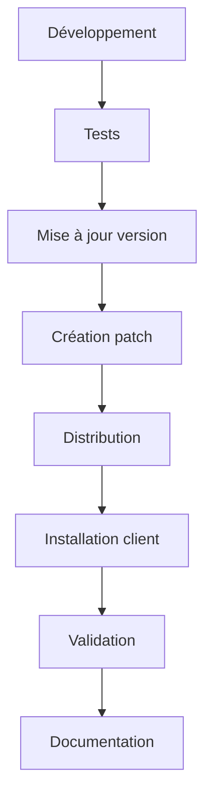

# 📋 Guide de Gestion des Mises à Jour - Matelas App

## 🎯 Vue d'ensemble

Ce système de gestion des mises à jour permet de maintenir et mettre à jour l'application Matelas en production de manière sécurisée et automatisée.

## 🏗️ Architecture du Système

### Composants Principaux

1. **`version_manager.py`** - Gestionnaire de version central
2. **`update_manager_gui.py`** - Interface graphique de gestion
3. **`deploy_patch.py`** - Script de déploiement automatisé
4. **`launch_update_manager.bat`** - Lanceur Windows

### Structure des Fichiers

```
MATELAS_FINAL/
├── VERSION.json              # Informations de version actuelle
├── CHANGELOG.md              # Historique des modifications
├── patches/                  # Dossier des patches
├── backups/                  # Sauvegardes automatiques
├── dist/                     # Packages de distribution
├── version_manager.py        # Gestionnaire de version
├── update_manager_gui.py     # Interface de gestion
├── deploy_patch.py          # Script de déploiement
└── launch_update_manager.bat # Lanceur Windows
```

## 🚀 Workflow de Développement

### 1. Développement Local

```bash
# 1. Faites vos modifications dans le code
# 2. Testez les changements
# 3. Mettez à jour la version
python -c "from version_manager import version_manager; version_manager.update_version('patch', 'Description des modifications')"

# 4. Créez un patch pour la version cible
python deploy_patch.py patch --target-version 1.0.0 --description "Correction bug extraction dates"
```

### 2. Création d'un Patch

#### Via l'Interface Graphique
1. Lancez `update_manager_gui.py`
2. Cliquez sur "Créer Patch"
3. Spécifiez la version cible et la description
4. Le patch sera créé dans le dossier `patches/`

#### Via la Ligne de Commande
```bash
# Patch simple
python deploy_patch.py patch --target-version 1.0.0 --description "Correction bug"

# Package complet
python deploy_patch.py full --description "Nouvelle version majeure"
```

### 3. Distribution au Client

Le système génère automatiquement un package ZIP contenant :
- Le patch de mise à jour
- Les instructions d'installation
- Le gestionnaire de mises à jour
- Les métadonnées du patch

## 📦 Types de Versions

### Semantic Versioning (SemVer)

- **MAJOR.MINOR.PATCH**
  - **MAJOR** : Changements incompatibles
  - **MINOR** : Nouvelles fonctionnalités compatibles
  - **PATCH** : Corrections de bugs

### Exemples

```bash
# Correction de bug
version_manager.update_version('patch', 'Correction extraction dates')

# Nouvelle fonctionnalité
version_manager.update_version('minor', 'Ajout support nouveaux formats')

# Changement majeur
version_manager.update_version('major', 'Refonte complète interface')
```

## 🔧 Utilisation en Production

### Pour le Client

#### Installation d'un Patch

1. **Fermez l'application Matelas**

2. **Placez le fichier ZIP dans le dossier de l'application**
   ```
   MATELAS_FINAL/
   └── matelas_patch_v1.0.0_to_v1.0.1.zip
   ```

3. **Extrayez le contenu du ZIP**

4. **Lancez le gestionnaire de mises à jour**
   ```bash
   # Windows
   launch_update_manager.bat
   
   # Ou directement
   python update_manager_gui.py
   ```

5. **Appliquez le patch**
   - Onglet "Patches"
   - Sélectionnez le patch
   - Cliquez "Appliquer Patch"

6. **Relancez l'application**
   ```bash
   python app_gui.py
   ```

#### Vérification de la Version

Dans l'application principale :
- Menu **Paramètres** → **Gestionnaire de mises à jour**
- Affiche la version actuelle et l'historique

### Pour le Développeur

#### Création d'un Patch

```bash
# 1. Mise à jour de la version
python -c "
from version_manager import version_manager
version_manager.update_version('patch', 'Correction bug extraction')
"

# 2. Création du patch
python deploy_patch.py patch --target-version 1.0.0 --description "Correction bug extraction"

# 3. Le package est créé dans dist/
# 4. Envoyez le fichier .zip au client
```

#### Gestion des Packages

```bash
# Lister les packages disponibles
python deploy_patch.py list

# Nettoyer les anciens packages (garder les 5 plus récents)
python deploy_patch.py clean --keep 5
```

## 🛠️ Fonctionnalités Avancées

### Gestionnaire de Version

```python
from version_manager import version_manager

# Informations de version
info = version_manager.get_version_info()
print(f"Version: {info['version']}")
print(f"Build: {info['build']}")

# Vérification des mises à jour
updates = version_manager.check_for_updates()

# Liste des patches
patches = version_manager.list_patches()
```

### Interface Graphique

Le gestionnaire de mises à jour offre :

- **Informations de version** : Version actuelle, build, date
- **Actions de version** : Mise à jour patch/minor/major
- **Gestion des patches** : Création et application
- **Changelog** : Historique des modifications
- **Instructions** : Guide d'utilisation

### Scripts de Déploiement

```bash
# Création de patch
python deploy_patch.py patch --target-version 1.0.0 --description "Description"

# Package complet
python deploy_patch.py full --description "Nouvelle version"

# Gestion des packages
python deploy_patch.py list
python deploy_patch.py clean --keep 5
```

## 🔒 Sécurité et Sauvegarde

### Sauvegardes Automatiques

- **Backup avant patch** : Sauvegarde automatique avant application
- **Rollback possible** : Possibilité de revenir à la version précédente
- **Validation des fichiers** : Vérification des hashes SHA256

### Validation des Patches

```python
# Vérification de l'intégrité
patch_metadata = version_manager.validate_patch("patch_file.zip")
if patch_metadata['valid']:
    print("Patch valide")
else:
    print("Patch corrompu")
```

## 📊 Monitoring et Logs

### Fichiers de Log

- **`logs/matelas_app.log`** : Logs généraux de l'application
- **`logs/matelas_errors.log`** : Erreurs critiques
- **`VERSION.json`** : Métadonnées de version

### Informations de Version

```json
{
  "version": "1.0.1",
  "build": "15",
  "date": "2024-01-15T10:30:00",
  "hash": "sha256_hash_of_files",
  "files": {
    "app_gui.py": "file_hash",
    "backend/main.py": "file_hash"
  },
  "dependencies": {
    "PyQt6": "6.4.0",
    "fastapi": "0.95.0"
  }
}
```

## 🚨 Dépannage

### Problèmes Courants

#### Erreur "Module non disponible"
```bash
# Vérifiez que tous les fichiers sont présents
ls version_manager.py update_manager_gui.py
```

#### Patch ne s'applique pas
```bash
# Vérifiez les permissions
# Assurez-vous que l'application est fermée
# Vérifiez l'espace disque
```

#### Version incorrecte
```bash
# Réinitialisez la version
python -c "
from version_manager import version_manager
version_manager.current_version['version'] = '1.0.0'
version_manager._save_version()
"
```

### Logs de Débogage

```python
import logging
logging.basicConfig(level=logging.DEBUG)

from version_manager import version_manager
# Les opérations seront loggées en détail
```

## 📈 Bonnes Pratiques

### Développement

1. **Testez toujours** avant de créer un patch
2. **Documentez les changements** dans le changelog
3. **Utilisez des versions sémantiques** appropriées
4. **Créez des patches incrémentaux** plutôt que des packages complets

### Production

1. **Sauvegardez** avant toute mise à jour
2. **Testez sur un environnement** similaire
3. **Communiquez** les changements au client
4. **Surveillez** les logs après mise à jour

### Maintenance

1. **Nettoyez régulièrement** les anciens packages
2. **Archivez** les versions importantes
3. **Mettez à jour** la documentation
4. **Formez** les utilisateurs

## 🔄 Workflow Complet

### Cycle de Développement



### Exemple de Workflow

```bash
# 1. Développement
# ... modifications du code ...

# 2. Tests
python -m pytest tests/

# 3. Mise à jour version
python -c "
from version_manager import version_manager
version_manager.update_version('patch', 'Correction bug extraction dates')
"

# 4. Création patch
python deploy_patch.py patch --target-version 1.0.0 --description "Correction bug extraction dates"

# 5. Distribution
# Envoyez le fichier dist/matelas_patch_v1.0.0_to_v1.0.1.zip

# 6. Installation client
# Le client utilise update_manager_gui.py
```

## 📞 Support

### En Cas de Problème

1. **Consultez les logs** dans `logs/`
2. **Vérifiez la version** avec `VERSION.json`
3. **Testez le patch** sur un environnement propre
4. **Contactez le support** avec les logs d'erreur

### Ressources

- **Documentation** : Ce fichier README
- **Logs** : `logs/matelas_app.log`
- **Version** : `VERSION.json`
- **Changelog** : `CHANGELOG.md`

---

**© Matelas App - Système de Gestion des Mises à Jour v1.0** 